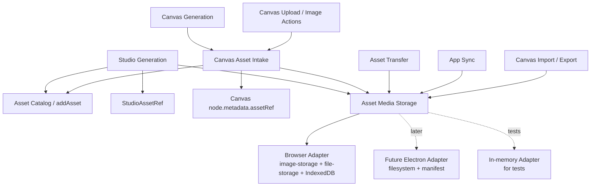

# Asset Media Storage 与 Canvas Asset Intake 完整方案

> 日期：2026-07-08
> 议题：把 Studio 与 Canvas 的媒体本体存储收束到共同 Deep Module，并让 Canvas 生成结果像 Studio 一样进入本地素材库
> 结论强度：Strong
> 视角：本文使用 `codebase-design` 词汇，把 `asset 媒体存储边界` 与生成结果入库拆成两个相邻但不同的 `Module`。

## 1. 核心结论

这次讨论里其实有两个问题，不能混成一个万能层：

1. **媒体本体怎么保存。**
   AI 生成出的图片、视频、音频，或者用户上传的文件，最终都要把 bytes/blob/dataUrl 保存到本地存储系统。当前 Web 阶段是 `image-storage` / `file-storage` / IndexedDB/localforage，未来桌面端可能是 Electron 本地文件系统。
2. **生成结果怎么进入本地素材库并被 Studio/Canvas 引用。**
   保存图片本体之后，还要创建 asset 记录，再把 `assetId` 写回 Studio 候选引用或 Canvas 节点 metadata。

推荐的完整方案是两层：

```txt
AI 生成 / 用户上传 / 导入
        ↓
Asset Media Storage
保存媒体本体，返回 storageKey/url/mimeType/尺寸/大小
        ↓
Asset Catalog / addAsset
创建本地素材库 asset 记录
        ↓
StudioAssetRef 或 Canvas assetRef
保存使用关系，而不是复制媒体文件
```

第一层应抽成共同的深 `Module`：

```txt
Asset Media Storage Module
文件建议：web/src/services/asset-media-storage.ts
```

第二层不应该塞进这个 storage `Module`。Studio 已经有一条内联的 asset-first 生成链路；Canvas 需要补一个上层 `Module`：

```txt
Canvas Asset Intake Module
文件建议：web/src/app/(user)/canvas/services/canvas-asset-intake.ts
```

一句话版：

> `Asset Media Storage` 解决“图片/视频/音频文件本身怎么保存”；`Canvas Asset Intake` 解决“Canvas 生成结果怎么像 Studio 一样创建 asset 并写回节点引用”。

## 2. 术语澄清

### 2.1 “生成图的默认二进制写入”是什么意思

这句话指的是保存图片本体这个动作，不是创建 asset 记录。

当前 Studio 默认逻辑大致是：

```txt
AI 返回 image.dataUrl
-> defaultStoreImage(dataUrl)
-> uploadImage(dataUrl)
-> 图片本体保存进 image-storage / IndexedDB
-> 返回 storageKey，例如 image:xxx
```

这里的“二进制”就是图片文件本身的内容。它可能以 `dataUrl`、base64、`Blob` 或文件流的形态出现，但最终都代表媒体 bytes。

### 2.2 “生成图能不能直接保存”

能，而且应该默认保存。

但正确的“直接保存”不是把 base64 塞进 Studio 项目 JSON 或 Canvas node metadata，而是分三层保存：

```txt
图片本体
-> 保存到 Asset Media Storage

素材记录
-> 保存到本地素材库 asset

使用关系
-> Studio 保存 StudioAssetRef
-> Canvas 保存 node.metadata.assetRef / assetRefs
```

不推荐这样：

```ts
shot.image = "data:image/png;base64,...很长..."
```

也不推荐这样：

```ts
node.metadata.content = "data:image/png;base64,...很长..."
```

原因是项目数据会膨胀，迁移 Electron 文件系统会困难，同一媒体会被复制多份，删除保护和引用扫描也会变脆。

## 3. 领域约束

这个方案受 `CONTEXT.md` 和 ADR 的直接约束。

### 3.1 本地素材库

`本地素材库` 是桌面端保存和使用的 asset 集合，包含用户成功生成、导入或上传的图片、视频、音频和文本素材。它不归 `mange-backend` 所有。

这意味着：生成成功后进入本地素材库，不是用户手动精选之后才进入。

### 3.2 Studio 候选媒体

`Studio 候选媒体` 是本地素材库中的 asset 在 Studio 项目、镜头、角色、场景或道具中的候选引用关系。即使未被选中，只要候选关系仍在项目记录中就应保留。

这意味着：Studio 不应该有自己的独立图片文件体系。它应该保存 asset 引用。

### 3.3 Canvas 节点媒体

`Canvas 节点媒体` 是本地素材库中的 asset 在画布节点中的引用关系。画布项目负责节点位置、尺寸、连线和画布上下文。

这意味着：Canvas 生成图、上传图和后续图片编辑结果，也应该逐步变成 asset-first，而不是只作为画布私有媒体存在。

### 3.4 素材沉淀

`素材沉淀` 是用户对本地素材库中的 asset 进行收藏、打标签、归档到项目资产、标记精选或整理复用的动作，不是生成结果进入素材库的前置条件。

这意味着：不要把“进入素材库”和“用户整理精选”混在一起。生成成功进入素材库，后续整理是另一层用户动作。

### 3.5 asset 媒体存储边界

`asset 媒体存储边界` 是本地素材库保存 asset 媒体文件的服务边界。当前 Web 阶段可复用 `image-storage` 和 `file-storage` 存入 IndexedDB，未来 Electron 阶段可迁移到本地文件系统。

这正是 `Asset Media Storage Module` 应该承担的 `Seam`。

相关 ADR：

- `docs/adr/0019-asset-library-is-the-shared-media-boundary.md`
- `docs/adr/0020-retain-studio-candidates-until-explicit-removal.md`
- `docs/adr/0021-protect-referenced-assets-from-hard-delete.md`
- `docs/adr/0023-storage-engines-stay-behind-boundaries.md`

## 4. 当前状态

### 4.1 Studio 当前链路

Studio 的图片生成入口主要在 `web/src/services/api/studio-generation.ts`：

- `generateCastReferences()`：孵化道 / Cast / 角色 / 场景 / 道具参考图。
- `generateStoryboardShotImages()`：Shot / Storyboard 分镜候选图。
- `generateMissingStoryboardShotImages()`：批量补缺失 Shot 图，内部仍调用 `generateStoryboardShotImages()`。

生产环境默认保存图片本体的函数是：

```ts
async function defaultStoreImage(dataUrl: string) {
    const { uploadImage } = await import("@/services/image-storage");
    return uploadImage(dataUrl);
}
```

所以当前 Studio 所有生图保存，默认都是：

```txt
AI 返回 dataUrl
-> storeImage(image.dataUrl)
-> defaultStoreImage()
-> uploadImage()
-> image-storage / IndexedDB
```

然后 Studio 再创建 asset：

```txt
stored.url/storageKey/width/height/mimeType
-> input.addAsset(...)
-> 得到 assetId
```

最后写回 Studio 项目数据：

```txt
StudioAssetRef {
  assetId,
  kind: "image",
  role: "candidate" 或 "selected",
  metadata
}
```

判断：

- Studio 的 **asset-first 业务链路是对的**：生成图先保存媒体，再创建 asset，再写候选引用。
- Studio 的 **默认媒体保存 Implementation 还偏底层**：`defaultStoreImage` 直接 import `uploadImage`，还没有走上层 `Asset Media Storage Module`。
- Studio 的 `storeImage` 可注入，测试里可以传 fake storage。这是一个真实的 testability `Seam`，但还不是完整的 runtime storage `Seam`。

### 4.2 Canvas 当前缺口

Canvas 现在有不少地方会把图片或媒体本体存进 `image-storage` / `file-storage`：

- 图片生成主链路。
- 上传图片、视频、音频。
- crop/split/upscale/mask/angle 等图片动作。
- assistant 面板生成图。
- 画布导入导出。
- Canvas node media hydrate / cleanup。

但 Canvas 生成结果不稳定创建本地素材库 asset，也不稳定把 `assetRef` 写入 node metadata。

这就和 ADR-0019 的目标不完全一致：

```txt
所有成功生成、导入或上传的媒体都进入本地素材库，
Studio 和 Canvas 保存 asset 引用关系。
```

判断：

- Canvas 已经有保存媒体本体的能力。
- Canvas 缺的是上层 `Canvas Asset Intake Module`，也就是“生成成功后如何创建 asset，并把引用写回 Canvas node”。

### 4.3 Studio 与 Canvas 对照

和 Studio 对比时，可以把两边拆成同样的六层来看：

```txt
Studio
  Project data:
    Studio Repository
  Media binary:
    image-storage 目前直接用，未来 asset-media-storage
  Media catalog:
    addAsset 创建 Asset
  Project link:
    StudioAssetRef(assetId, role, metadata)
  Variant rules:
    Studio Image Variant Rules
  Deletion protection:
    Asset Reference Index 扫 assetRefs
```

Canvas 当前更像：

```txt
Canvas
  Project data:
    Canvas Store / Canvas Workspace Session
  Media binary:
    Canvas Node Media + image-storage / file-storage
  Media catalog:
    生成结果不一定 addAsset
  Project link:
    部分节点有 metadata.assetRef，但生成主链路不稳定写入
  Variant/batch rules:
    Canvas Graph Mutations 处理 batch root / child
  Deletion protection:
    Asset Reference Index 只扫描已有 assetRef / assetRefs
```

这个对照说明：Canvas 不需要把整个项目模型迁进 Asset，也不应该让 Canvas Store 直接承担 asset catalog 规则。真正缺的是一个类似 Studio generation 链路里的 asset-first 写入规则：

```txt
Canvas 生成成功
-> 存二进制
-> addAsset
-> Canvas node metadata.assetRef = { assetId, kind, role, metadata }
-> Canvas project 仍保存 node 渲染缓存 content/storageKey
```

最终应达到：

```txt
Canvas Project 保存节点结构、位置、连线、渲染缓存和 assetRef
Asset Catalog 保存素材记录
Asset Media Storage 保存 blob
Canvas 不再把生成媒体当成只有节点自己知道的东西
```

这就是 `Canvas Asset Intake Module` 的落点。它要对齐 Studio 的 asset-first 模式，但不复制 Studio 的所有候选图规则。

### 4.4 image-storage 与 file-storage 当前角色

`web/src/services/image-storage.ts` 当前隐藏：

- localforage store：`image_files`
- `image:${nanoid()}` key 生成
- data URL 到 Blob 的转换
- 图片宽高、mimeType、bytes 读取
- object URL cache
- blob read/write/delete/list

`web/src/services/file-storage.ts` 当前隐藏：

- localforage store：`media_files`
- `video:` / `audio:` / `file:` 等 prefix key 生成
- video/audio metadata 读取
- object URL cache
- blob read/write/delete/list

它们有 `Depth`，但它们是底层 engine，不是产品层最终 `Seam`。上层 caller 仍然需要知道：

- `image:` 应该走 `image-storage`。
- `video:` / `audio:` / `file:` 应该走 `file-storage`。
- `resolveImageUrl` 和 `resolveMediaUrl` 要分开调。
- `getImageBlob` 和 `getMediaBlob` 要分开调。
- 导出、同步、导入时要手写 storageKey prefix 判断。

这些知识应该被 `Asset Media Storage Module` 吃掉。

## 5. 推荐架构

### 5.1 总图



### 5.2 分层原则

不要把这些规则放进同一个 `Module`：

```txt
媒体本体存储
素材库 asset 创建
Studio 候选 selected/candidate 规则
Canvas node graph mutation
AI request / polling
WebDAV transport
删除保护
```

推荐分层：

| 层 | Module | 负责 | 不负责 |
| --- | --- | --- | --- |
| 媒体本体 | `Asset Media Storage` | 保存、读取、恢复、识别、收集 storageKey | 创建 asset、写 Studio/Canvas 引用 |
| 素材记录 | `Asset Catalog` / `addAsset` | 创建和维护本地素材库 asset | 媒体 bytes 怎么落盘 |
| Studio 使用关系 | Studio generation + image variant rules | 写 `StudioAssetRef`，维护 candidate/selected | Canvas node metadata |
| Canvas 使用关系 | `Canvas Asset Intake` | Canvas 生成/上传结果创建 asset，并写 node `assetRef` | AI 请求、底层 blob engine |
| Canvas 节点媒体生命周期 | `Canvas Node Media` | hydrate node media、assistant image、cleanup | 通用导入导出和 WebDAV |
| 同步/导出 | `Asset Transfer` / `App Sync` / `Canvas Export` | 包格式、远端传输、项目导入导出 | 本地 storage engine 分流 |

## 6. Module 1：Asset Media Storage

### 6.1 目标

`Asset Media Storage Module` 回答一个问题：

> 给我媒体内容或 storageKey，我负责把媒体本体保存、读取、恢复 URL，并隐藏当前 Web IndexedDB 与未来 Electron 文件系统的差异。

它应该成为 `CONTEXT.md` 里 `asset 媒体存储边界` 的代码落点。

推荐文件：

```txt
web/src/services/asset-media-storage.ts
web/src/services/asset-media-storage.test.ts
```

### 6.2 Interface 草案

第一版 Interface 可以保持小而深：

```ts
type AssetMediaKind = "image" | "video" | "audio" | "file" | "video-reference" | "audio-reference";

type AssetMediaInput =
    | { kind: "image"; input: string | Blob; suggestedName?: string }
    | { kind: "video" | "audio" | "file"; input: File | Blob; suggestedName?: string; mimeType?: string };

type StoredAssetMedia = {
    storageKey: string;
    url: string;
    mimeType: string;
    bytes: number;
    width?: number;
    height?: number;
    durationMs?: number;
};

storeAssetMedia(input: AssetMediaInput): Promise<StoredAssetMedia>;
readAssetMediaBlob(storageKey: string): Promise<Blob | null>;
writeAssetMediaBlob(storageKey: string, blob: Blob): Promise<StoredAssetMedia>;
resolveAssetMediaUrl(storageKey: string, fallback?: string): Promise<string>;
deleteAssetMedia(storageKeys: string[]): Promise<void>;

isAssetMediaStorageKey(value: unknown): value is string;
readAssetMediaKind(storageKey: string): AssetMediaKind | null;
collectAssetMediaStorageKeys(value: unknown): Set<string>;
assetMediaFileExtension(input: { storageKey?: string; mimeType?: string; url?: string }): string;
```

这个 Interface 隐藏：

- `image:` 是否特殊。
- `video:` / `audio:` / `file:` 走哪个底层 engine。
- `uploadImage` 与 `uploadMediaFile` 的差异。
- `getImageBlob` 与 `getMediaBlob` 的分流。
- `setImageBlob` 与 `setMediaBlob` 的分流。
- object URL cache 来自哪里。
- data URL 如何转 Blob。
- 图片宽高、音视频时长、mimeType、bytes 怎么读取。
- 文件扩展名 fallback。
- 嵌套对象里的 storageKey 如何收集。

### 6.3 Adapter

这是一个真实 `Seam`，因为变化源真实存在。

生产 Adapter：

```txt
Browser Asset Media Storage Adapter
-> image-storage
-> file-storage
-> IndexedDB/localforage
```

未来生产 Adapter：

```txt
Electron Asset Media Storage Adapter
-> local filesystem
-> project manifest / SQLite / app data
```

测试 Adapter：

```txt
In-memory Asset Media Storage Adapter
-> Map<storageKey, Blob>
-> fake metadata reader
```

这里要区分强度：

- `production adapter + test adapter` 可以证明这是可测试的真实 `Seam`。
- `Browser adapter + Electron adapter` 才是更强的 runtime `Seam`。

本项目里这个 `Seam` 值得抽，不只是因为测试方便，而是因为未来桌面端存储 engine 确实会变。

### 6.4 不放进这个 Module 的内容

`Asset Media Storage` 不负责：

- asset 列表、收藏、标签、精选、素材沉淀。
- `addAsset` 的 title/source/tags/metadata 规则。
- Studio candidate/selected 规则。
- Canvas node 位置、尺寸、连线、batch root。
- Canvas 生成 retry、partial failure、graph mutation。
- 资产删除保护。
- WebDAV 上传下载协议。
- AI request、polling、relay 参数。
- zip package 格式本身。

删除测试：

如果删掉 `Asset Media Storage`，这些复杂度会重新扩散到 Asset Transfer、Canvas Export、App Sync、Asset Catalog hydrate、Canvas Node Media、Studio generation 和未来 Electron adapter。这说明它有真实 `Locality`。

## 7. Module 2：Studio 生成入库链路

### 7.1 现状判断

Studio 已经基本符合 asset-first：

```txt
生成图片
-> 保存图片本体
-> addAsset 创建素材库记录
-> StudioAssetRef 写回角色/场景/道具/shot
```

孵化道和 Shot 的生图保存默认都使用 `uploadImage`：

```txt
generateCastReferences()
-> storeImage(image.dataUrl)
-> defaultStoreImage()
-> uploadImage()

generateStoryboardShotImages()
-> storeImage(image.dataUrl)
-> defaultStoreImage()
-> uploadImage()
```

批量补缺失 Shot 图最终也是调用 `generateStoryboardShotImages()`。

### 7.2 需要改进的点

Studio 当前的问题不是“没有保存到素材库”，而是：

```txt
defaultStoreImage 直接知道 uploadImage
```

更理想的形态：

```txt
defaultStoreImage
-> assetMediaStorage.storeAssetMedia({ kind: "image", input: dataUrl })
```

这样 Studio generation 不再知道底层是 `image-storage`、IndexedDB，还是未来 Electron 文件系统。

### 7.3 是否需要单独 Studio Asset Intake Module

第一阶段不建议新增单独的 `Studio Asset Intake Module`。

原因：

- Studio 生成链路已经集中在 `studio-generation.ts`。
- Studio 的候选引用规则已经有 `studio-image-variants.ts` 这种专门 `Module`。
- 当前主要问题是底层 storage seam 泄漏，不是 Studio asset 引用逻辑扩散严重。

可以先保留现有形态，只把 `defaultStoreImage` 迁移到 `Asset Media Storage`。

后续如果 Studio 增加视频、音频、导入素材、批量重生成、候选池维护等更多入口，再考虑抽 `Studio Asset Intake Module`。

## 8. Module 3：Canvas Asset Intake

### 8.1 为什么 Canvas 需要这一层

Canvas 当前有“保存媒体本体”的能力，但缺少统一的“生成结果进入本地素材库”的规则。

目标行为：

```txt
Canvas 生成图片成功
-> 保存图片本体
-> 创建 image asset
-> node.metadata.assetRef 写入 assetId/storageKey/source
-> 删除 asset 时能通过资产引用保护发现 Canvas 仍在使用
```

这对应 `CONTEXT.md` 的 `Canvas 节点媒体`：

```txt
本地素材库中的 asset 在画布节点中的引用关系，
画布项目负责节点位置、尺寸、连线和画布上下文。
```

### 8.2 关键设计判断

不要把这个需求理解成“把 Canvas 深 `Module` 迁移进 Asset”。更准确的说法是：

```txt
把 Canvas 生成出来的媒体结果登记为 Asset，
并让 Canvas node 保存 asset 引用。
```

Canvas 仍然是 Canvas，Asset 仍然是 Asset。中间补一个 `Canvas Asset Intake Module`。

职责应该这样分：

```txt
Canvas Project
只保存节点结构、位置、连线、渲染缓存、assetRef

Asset Catalog
保存素材记录：title、kind、tags、source、metadata、storageKey

Asset Media Storage
保存图片/视频/音频本体 blob

Canvas Asset Intake
负责把 Canvas 生成结果变成 asset，并生成 node metadata patch
```

因此不建议这样做：

```txt
Canvas Store
-> 直接 uploadImage
-> 直接 addAsset
-> 直接决定 asset metadata
-> 直接决定 deletion protection
```

那会让 Canvas Store 变成一个浅而大的 `Module`，把 Canvas graph、素材库、底层存储和删除保护揉在一起。

推荐的调用关系是：

```txt
Canvas 生成成功
-> Asset Media Storage 保存二进制
-> Canvas Asset Intake 调 addAsset 创建 Asset
-> Canvas Asset Intake 返回 assetRef / nodeMetadataPatch
-> Canvas Graph Mutations 把 patch 写进 node metadata
-> node 仍保留 content/storageKey 作为渲染缓存
```

这里最后一条很重要：Canvas node 不应该只剩 `assetId`。`content/storageKey` 仍然是画布渲染的快速缓存；`metadata.assetRef` 是素材库、删除保护和跨模块引用的稳定关系。

### 8.3 Interface 草案

推荐文件：

```txt
web/src/app/(user)/canvas/services/canvas-asset-intake.ts
web/src/app/(user)/canvas/services/canvas-asset-intake.test.ts
```

Interface 可以围绕“把一个 Canvas 产物登记成 asset，并返回 node patch”设计：

```ts
type CanvasAssetIntakeInput = {
    canvasId: string;
    nodeId: string;
    kind: "image" | "video" | "text";
    title: string;
    source: "canvas-generation" | "canvas-upload" | "canvas-edit" | "canvas-assistant";
    media?: StoredAssetMedia;
    text?: string;
    prompt?: string;
    model?: string;
    batchId?: string;
    parentNodeId?: string;
    createdAt: string;
};

type CanvasAssetIntakeResult = {
    assetId: string;
    assetRef: {
        assetId: string;
        kind: "image" | "video" | "text";
        role: "reference";
        storageKey?: string;
        source: string;
        createdAt: string;
        metadata: {
            source: "canvas-generation" | "canvas-upload" | "canvas-edit" | "canvas-assistant";
            canvasRole: "generated" | "uploaded" | "edited" | "assistant";
            canvasId: string;
            nodeId: string;
            prompt?: string;
            model?: string;
            batchId?: string;
            parentNodeId?: string;
        };
    };
    nodeMetadataPatch: Record<string, unknown>;
};

registerCanvasAsset(input: CanvasAssetIntakeInput): CanvasAssetIntakeResult;
```

真实实现里 `registerCanvasAsset` 需要注入：

```txt
addAsset
now
```

如果它也负责保存媒体本体，则再注入：

```txt
assetMediaStorage
```

但更推荐第一版让调用方先完成媒体 materialization，再把 `StoredAssetMedia` 交给 `Canvas Asset Intake`。这样它的职责更清楚：

```txt
Asset Media Storage：保存 bytes
Canvas Asset Intake：创建 asset + 生成 node metadata patch
```

第一版不建议扩展全局 `AssetReferenceRole`。现有引用 role 只有：

```txt
candidate / selected / reference
```

所以 Canvas 生成结果第一阶段统一使用：

```txt
role: "reference"
```

Canvas 自己的来源语义放进 metadata：

```txt
metadata.source: "canvas-generation" | "canvas-upload" | "canvas-edit" | "canvas-assistant"
metadata.canvasRole: "generated" | "uploaded" | "edited" | "assistant"
```

不要硬套 Studio 的 `candidate/selected`。Studio 有候选图选择池，所以 `candidate/selected` 很自然；Canvas 当前更像生成结果节点。等 Canvas 也出现同一节点多版本候选池时，再讨论是否扩展全局 `AssetReferenceRole` 或引入 Canvas-specific variant rules。

### 8.4 它隐藏的规则

`Canvas Asset Intake` 应隐藏：

- Canvas 生成图 asset 的 title/source/tags/metadata 怎么写。
- `metadata.assetRef` 的 shape。
- `metadata.assetRef.role` 第一阶段固定为 `"reference"`。
- `metadata.assetRef.metadata.source` 和 `metadata.assetRef.metadata.canvasRole` 如何从生成、上传、编辑、assistant 来源派生。
- batch generation 每张 child image 如何创建 asset。
- root node 是否保存 primary `assetRef` 或 `assetRefs` 列表。
- retry 生成新结果时是否创建新 asset。
- prompt/model/canvasId/nodeId/batchId 如何进入 asset metadata。
- asset 记录和 node metadata patch 的一致性。

### 8.5 它不负责的规则

`Canvas Asset Intake` 不负责：

- AI 请求和重试策略。
- 图片 bytes 的底层存储 engine。
- Canvas node 的具体布局和连线算法。
- React Flow mutation 细节。
- Studio 候选图规则。
- 删除保护扫描。
- WebDAV 同步。

### 8.6 Canvas 行为目标

第一阶段建议只覆盖 Canvas 图片生成主链路：

```txt
generateCanvasTextToImage()
retryCanvasGeneratedImage()
```

成功生成单图：

```txt
生成图片
-> materialize media
-> addAsset(kind: "image")
-> image node metadata.assetRef = assetId/kind/role/storageKey/source/metadata
-> image node 继续保留 content/storageKey 作为渲染缓存
```

成功生成多图：

```txt
每个 child image node 各自创建一个 image asset
每个 child node 写自己的 metadata.assetRef
root node 可写 primary assetRef 和 assetRefs 列表
```

retry：

```txt
retry 成功创建新 asset
旧 asset 不自动删除
旧节点引用是否保留，按现有 retry graph 语义处理
```

partial failure：

```txt
成功的图片正常创建 asset
失败的图片不创建 asset
batch metadata 记录失败信息
```

删除保护：

```txt
Asset Reference Index
-> 扫 Studio assetRefs
-> 扫 Canvas node metadata.assetRef / assetRefs
-> 阻止删除仍被 Canvas 使用的 asset
```

文本：

```txt
AI 生成文本可以后续创建 kind: "text" asset
用户手写文本节点不要自动入库
```

视频：

```txt
Canvas 生成视频可后续创建 kind: "video" asset
第一刀不要和图片生成一起改
```

音频：

```txt
当前 AssetKind 还没有 audio
Asset Media Storage 可以支持 audio blob
但本地素材库 audio asset 需要另开 Asset model/UI 设计
```

## 9. Canvas Node Media 的位置

`web/src/app/(user)/canvas/services/canvas-node-media.ts` 仍然应该保留。

它是 Canvas-specific 的深 `Module`，负责：

- Canvas image/video/audio node metadata hydrate。
- 旧 data URL 到 storageKey 的迁移。
- assistant image hydrate。
- unused node media cleanup。
- Canvas node media storageKey 收集。

不要把它和 `Asset Media Storage` 合并。

关系应该是：

```txt
Asset Media Storage
负责通用媒体本体 I/O

Canvas Node Media
负责 Canvas node metadata 和生命周期

Canvas Asset Intake
负责 Canvas 产物创建 asset 并写 assetRef
```

后续可以让 `Canvas Node Media` 的默认 adapter 复用 `Asset Media Storage`，但不要让 Asset Transfer、App Sync 反过来依赖 `Canvas Node Media`，否则它们会被迫学习 Canvas 类型，`Interface` 会变浅。

## 10. 迁移计划

### Phase 1：新增 Asset Media Storage

新增：

```txt
web/src/services/asset-media-storage.ts
web/src/services/asset-media-storage.test.ts
```

先实现：

- `isAssetMediaStorageKey`
- `readAssetMediaKind`
- `collectAssetMediaStorageKeys`
- `readAssetMediaBlob`
- `writeAssetMediaBlob`
- `resolveAssetMediaUrl`
- `assetMediaFileExtension`
- `storeAssetMedia`

默认 Adapter 内部复用：

```txt
image-storage.ts
file-storage.ts
```

测试使用 in-memory adapter，不依赖 localforage。

### Phase 2：迁移导入导出和同步

第一批迁移：

- `web/src/app/(user)/assets/asset-transfer.ts`
- `web/src/app/(user)/canvas/utils/canvas-export.ts`
- `web/src/app/(user)/canvas/page.tsx` 里的画布导入 blob 写入
- `web/src/services/app-sync.ts`

理由：

- 这些位置 storageKey prefix 泄漏最明显。
- 它们接近 ADR-0023 的“存储 engine 藏在边界后”问题。
- 它们不需要同时改 Canvas graph mutation。

### Phase 3：迁移 Asset Catalog hydrate

目标：

- `web/src/stores/use-asset-store.ts` 不直接 import `resolveImageUrl` / `resolveMediaUrl`。
- legacy image data URL asset 迁移进入 asset media helper。
- image/video asset URL 恢复走统一 `resolveAssetMediaUrl`。

注意：

- `removeAsset` 的 deletion protection 不要放进 `Asset Media Storage`。
- `cleanupUnusedCanvasNodeMedia` 短期可保留在 Canvas Node Media。

### Phase 4：迁移 Studio defaultStoreImage

目标：

```txt
studio-generation.ts
defaultStoreImage()
-> assetMediaStorage.storeAssetMedia({ kind: "image", input: dataUrl })
```

不改变 Studio 外部行为：

- 仍创建 image asset。
- 仍写 `StudioAssetRef`。
- 仍保留候选图直到显式移除。
- 测试仍可以注入 fake `storeImage`。

这一步只是把底层 `uploadImage` 依赖收进共同 `Seam`。

### Phase 5：新增 Canvas Asset Intake 并接入图片生成主链路

新增：

```txt
web/src/app/(user)/canvas/services/canvas-asset-intake.ts
web/src/app/(user)/canvas/services/canvas-asset-intake.test.ts
```

先接：

- `generateCanvasTextToImage()`
- `retryCanvasGeneratedImage()`

暂不接：

- Canvas 上传。
- Canvas assistant。
- crop/split/upscale/mask/angle。
- video/audio generation。
- text asset 自动入库。

原因：

- 第一刀先让核心“Canvas 生图进入素材库”跑通。
- 上传和图片动作虽然也应该进入 asset，但它们还混有节点创建、编辑源关系、assistant session 等额外语义。
- 一次只移动一个主要 `Seam`，风险更低。

这一阶段的 vertical slice 验收口径：

```txt
Canvas 图片生成成功
-> 保存媒体本体
-> addAsset 创建 image asset
-> 当前 image node 写 metadata.assetRef
-> node 仍保留 content/storageKey 渲染缓存
-> Asset Reference Index 能扫描到这条 Canvas 引用
```

单图：

```txt
一个生成结果
-> 一个 image asset
-> 当前 image node 一个 assetRef
```

多图：

```txt
每个 child image node
-> 各自一个 image asset
-> 各自一个 assetRef

batch root
-> 可保存 primary assetRef 和 assetRefs 摘要
-> 不替代 child refs
```

retry：

```txt
retry 成功
-> 创建新 asset
-> 写入新结果 node 的 assetRef
-> 不自动删除旧 asset
```

这一阶段不要求历史 Canvas 节点全量迁移。旧节点如果只有 `storageKey`、没有 `assetRef`，可以等 hydrate、用户触发保存或单独 migration 再补。

### Phase 6：扩展 Canvas 上传、图片动作、assistant、video/audio

后续把这些入口逐步迁到同一套规则：

- `use-canvas-file-nodes.ts`
- `use-canvas-image-actions.ts`
- `canvas-assistant-panel.tsx`
- `services/api/video.ts`
- `services/api/audio.ts`

每个入口都应先回答：

```txt
这个产物是否应该成为本地素材库 asset？
asset 的 source/tags/title/metadata 是什么？
Canvas node 应该写单个 assetRef 还是 assetRefs？
旧引用是否保留？
```

## 11. 测试策略

### 11.1 Asset Media Storage tests

覆盖：

1. `image:` storageKey 读写走 image adapter。
2. `video:` / `audio:` / `file:` 读写走 media adapter。
3. `video-reference:` / `audio-reference:` 能被识别和收集。
4. `collectAssetMediaStorageKeys` 能递归对象、数组、字符串。
5. `collectAssetMediaStorageKeys` 不误收 `http://example.test/image:abc`。
6. `assetMediaFileExtension` 对 png/jpeg/webp/gif/mp4/webm/wav/mp3 和 unknown 有稳定 fallback。
7. `resolveAssetMediaUrl` 对缺失 blob 有 fallback。
8. `storeAssetMedia` 返回稳定的 `storageKey/url/mimeType/bytes/width/height`。

测试表面应该穿过 `Asset Media Storage` 的 `Interface`，不要分别 mock `getImageBlob` / `getMediaBlob`。

### 11.2 Studio generation tests

迁移 `defaultStoreImage` 后，Studio 原有测试仍应继续通过：

- fake `storeImage` 能注入。
- `generateCastReferences()` 创建 asset 并写 `StudioAssetRef`。
- `generateStoryboardShotImages()` 创建 asset 并写 shot candidate refs。
- candidate/selected 规则不变。

新增少量测试即可确认默认 storage adapter 调用的是 `Asset Media Storage`，不需要在 Studio 测 localforage。

### 11.3 Canvas Asset Intake tests

覆盖：

1. 单张生成图创建 image asset。
2. node metadata patch 包含 `assetRef`。
3. asset metadata 包含 canvasId、nodeId、prompt、model、source、createdAt。
4. batch 多图每张 child image 创建独立 asset。
5. retry 成功创建新 asset，不自动删除旧 asset。
6. partial failure 只给成功结果创建 asset。
7. 不把手写文本节点自动入库。

### 11.4 集成风险测试

迁移导入导出和同步时应补：

- asset package 导出能读取所有 asset media blob。
- asset package 导入能保留原 storageKey 或按规则写入新 storageKey。
- Canvas project export 只收集有效 asset media storageKey。
- WebDAV 本地缺失时下载写入，本地存在时跳过，远端缺失时上传。

## 12. 风险和开放问题

### 12.1 命名：Asset Binary Storage 还是 Asset Media Storage

文档原名是 `Asset Binary Storage`，但代码建议使用：

```txt
asset-media-storage.ts
```

原因：

- 项目领域词是 `asset 媒体存储边界`。
- 这个 `Module` 返回的不只是 bytes，还包含 `storageKey`、可预览 URL、mimeType、尺寸和大小。
- “Media” 比 “Binary” 更贴近上层 caller 的心智。

### 12.2 test adapter 算不算真实 Adapter

算，但证据强度不同。

```txt
production adapter + test adapter
-> 证明这是可测试性 Seam

Browser adapter + Electron adapter
-> 证明这是 runtime 架构 Seam
```

`Asset Media Storage` 的价值不只来自测试 adapter，而是来自真实 runtime 变化：Web IndexedDB 与未来 Electron 本地文件系统。

### 12.3 AssetKind 暂无 audio

当前 Asset Catalog 的 `AssetKind` 主要是：

```txt
text | image | video
```

但底层 storageKey 已经可能有 `audio:`。因此：

- `Asset Media Storage` 可以支持 audio blob。
- 不要顺手把 audio 加进本地素材库 UI。
- audio asset 需要另开 Asset model/UI 设计。

### 12.4 remote URL 没有 storageKey

部分视频生成结果可能只有远程 URL，没有本地 `storageKey`。

规则建议：

```txt
有 storageKey
-> 走 Asset Media Storage

无 storageKey 但 URL 可播放
-> 保留远程 URL

导出/同步
-> 只处理有效 storageKey
```

### 12.5 旧 Canvas 节点媒体如何迁移

旧项目里可能已经有：

- 只有 `storageKey`，没有 `assetRef` 的 image node。
- 只有 data URL 的 legacy image node。
- assistant session 里的临时图。

第一阶段不强制历史数据全量回填 asset。可以采用温和策略：

```txt
新生成结果全部 asset-first
旧节点在 hydrate 或用户触发保存时再补 assetRef
删除保护只保护已有 assetRef/assetRefs
```

如果要做历史批量迁移，应单独设计 migration UI 和冲突规则。

### 12.6 删除 asset 是否清理媒体本体

默认不要在 `Asset Media Storage` 里做删除保护。

正确顺序：

```txt
removeAsset
-> Asset Reference Index 检查 Studio / Canvas 引用
-> 允许删除 asset 记录
-> 再考虑是否清理未引用 storageKey
```

`Asset Media Storage` 只执行“删除这些 storageKey 对应的媒体本体”，不判断业务上能不能删。

## 13. 推荐第一刀

如果要开始实现，建议第一刀不要直接碰所有生成入口。

最稳的第一组改动：

1. 新增 `web/src/services/asset-media-storage.ts`。
2. 新增 `web/src/services/asset-media-storage.test.ts`。
3. 集中实现 storageKey prefix、blob read/write、URL resolve、key collect、file extension。
4. 迁移 `asset-transfer.ts`。
5. 迁移 `canvas-export.ts`。
6. 迁移 `canvas/page.tsx` 的画布导入 blob 写入。
7. 迁移 `app-sync.ts` 的本地媒体读写和 key 收集。

第二组改动：

1. 迁移 `use-asset-store.ts` 的 hydrate。
2. 迁移 Studio `defaultStoreImage` 到 `Asset Media Storage`。

第三组改动：

1. 新增 `Canvas Asset Intake Module`。
2. 接入 `generateCanvasTextToImage()`。
3. 接入 `retryCanvasGeneratedImage()`。
4. 让新生成 Canvas 图片创建 asset，并把 `assetRef` 写回 node metadata。

暂时不要动：

- 所有 Canvas 上传路径。
- Canvas assistant。
- 图片编辑动作。
- video/audio generation。
- 历史 Canvas 节点批量迁移。
- AssetKind audio 扩展。

这样切的好处是：

- 第一刀先解决共同 storage `Seam`，不搅动 Canvas graph。
- 第二刀让 Studio 从直接 `uploadImage` 过渡到共同媒体存储 `Module`。
- 第三刀再补 Canvas asset-first，使 Canvas 生成图像和内容逐步达到 Studio 的保存语义。

## 14. 最终目标状态

最终希望达到：

```txt
Studio 生成图片
-> Asset Media Storage 保存图片本体
-> addAsset 创建 image asset
-> StudioAssetRef 记录候选引用

Canvas 生成图片
-> Asset Media Storage 保存图片本体
-> Canvas Asset Intake 创建 image asset
-> node.metadata.assetRef 记录节点引用
-> node.content/storageKey 保留为渲染缓存

导入 / 导出 / WebDAV 同步
-> 统一通过 Asset Media Storage 读写 blob 和收集 storageKey

未来 Electron
-> 替换 Asset Media Storage Adapter
-> Studio / Canvas / App Sync 尽量不改业务逻辑
```

这个方案的 `Depth` 来自：

- 上层 caller 不再学习 `image-storage` / `file-storage` 分流。
- Studio 和 Canvas 不各自拥有媒体文件体系。
- Canvas 生成结果不再只是画布私有媒体，而是本地素材库 asset 的节点引用。
- Electron 文件落盘迁移集中在一个 `Seam`。

这个方案的 `Locality` 来自：

- storage engine 变化集中在 `Asset Media Storage`。
- Canvas asset 创建规则集中在 `Canvas Asset Intake`。
- Studio candidate/selected 规则继续留在 Studio 自己的 `Module`。
- 删除保护继续由 Asset Reference Index 负责。

所以完整解决方案不是一个大抽象，而是两个清晰 `Module`：

```txt
Asset Media Storage
解决共同媒体本体存储

Canvas Asset Intake
解决 Canvas 产物进入本地素材库并写回节点引用
```
