# 从 codebase-design 角度梳理当前项目

> 阅读日期：2026-07-07
> 视角：本文使用 `codebase-design` 的词汇，把项目看成若干个有清晰 `Interface` 和 `Seam` 的 `Module`。这里的 `Interface` 不只是 TypeScript 类型，还包括调用方必须知道的不变量、调用顺序、错误模式、性能和依赖约束。

## 1. 结论先行

当前项目已经从“页面和 hook 承担大量业务规则”的形态，明显走向了“深 Module 承载规则，页面作为 composition root”的形态。

最值得抓住的总图是：

```mermaid
flowchart TB
    App["App / Next.js Shell"]

    Asset["Asset Module"]
    Canvas["Canvas Module"]
    Studio["Studio Module"]
    Support["Support Modules"]

    AssetCatalog["Asset Catalog"]
    AssetRefs["Asset Reference Index"]
    AssetLibrary["Local Asset Library View Model"]
    AssetTransfer["Asset Transfer"]

    CanvasProject["Canvas Project"]
    CanvasSession["Canvas Workspace Session"]
    CanvasEditing["Canvas Editing Engine"]
    CanvasGraph["Canvas Graph Mutations"]
    CanvasMedia["Canvas Node Media"]
    CanvasGeneration["Canvas Generation Orchestration"]
    CanvasSemantics["Canvas Node Semantics"]
    CanvasUI["Canvas UI Surface"]

    StudioRepo["Studio Repository"]
    StudioGeneration["Studio Generation Adapter"]
    StudioWorkspace["Studio Workspace Model"]
    StudioRefs["Studio Shot Reference Resolver"]
    StudioVariants["Studio Image Variant Rules"]

    Config["AI Config / Model Selection"]
    Request["Same-Origin Request Adapter"]
    BinaryStorage["Binary Storage Engines"]

    App --> Asset
    App --> Canvas
    App --> Studio
    App --> Support

    Asset --> AssetCatalog
    Asset --> AssetRefs
    Asset --> AssetLibrary
    Asset --> AssetTransfer

    Canvas --> CanvasProject
    Canvas --> CanvasSession
    Canvas --> CanvasEditing
    Canvas --> CanvasGraph
    Canvas --> CanvasMedia
    Canvas --> CanvasGeneration
    Canvas --> CanvasSemantics
    Canvas --> CanvasUI

    Studio --> StudioRepo
    Studio --> StudioGeneration
    Studio --> StudioWorkspace
    Studio --> StudioRefs
    Studio --> StudioVariants

    Support --> Config
    Support --> Request
    Support --> BinaryStorage

    CanvasMedia --> BinaryStorage
    AssetCatalog --> AssetRefs
    StudioGeneration --> AssetCatalog
    StudioGeneration --> StudioRepo
    StudioGeneration --> Config
    StudioGeneration --> Request
    CanvasGeneration --> CanvasGraph
    CanvasGeneration --> CanvasMedia
    CanvasGeneration --> Request
```



目前最强的 deepening 成果有 6 个：

1. `Canvas Graph Mutations`：把上传替换、删除节点、批量图 root/child 修复、生成结果回填、临时 UI 状态清理等图规则收进纯计算 Module。
2. `Canvas Node Media`：把 `storageKey`、object URL、历史 data URL 迁移、助手图片 hydrate、未使用媒体清理等媒体生命周期收进一个 media seam。
3. `Studio Generation Adapter`：把剧本解析、Cast 参考图生成、Storyboard 生成、候选/选中回填、失败标记、repository 写入、asset 创建串成可测的流程 Module。
4. `Studio Shot Reference Resolver`：把镜头显式引用到角色/场景/道具 selected image 的解析规则集中。
5. `Studio Image Variant Rules`：把 candidate/selected 的唯一性、追加、选择、移除规则集中。
6. `Model Selection`：把 Studio 项目偏好、全局模型、远程可用模型、本地直连 readiness 的选择规则从页面中移出。

仍然最需要继续 deepening 的位置有 4 个：

1. `Canvas Workspace Session` 返回面仍然很宽，caller 仍需要理解大量内部 state 和 setter。
2. `Canvas Generation Orchestration` 只覆盖了 text-to-image 和 retry image 的一部分；Config/Image/Video/Audio 生成仍有不少图变更、请求和上传逻辑留在 hook。
3. `Canvas Node Semantics` 分散在 `canvas-page-utils.ts`、`canvas-node-generation.ts`、`canvas-resource-references.ts`、具体生成 hook 中，生成上下文、上游资源、metadata 语义还没有一个主 seam。
4. `Asset Binary Storage` 和 `Canvas Node Media` 的关系已经改善，但导入导出、asset hydrate、canvas export 仍有一些直接读写 `image-storage` / `file-storage` 的调用。

## 2. 项目主 Module 分层

从产品语义上，项目可以稳定理解为 3 个主 Module 加 3 组支撑 Module：

| 层级 | Module | 它回答的问题 | 主要代码 |
| --- | --- | --- | --- |
| 主 Module | `Asset` | 素材是什么、怎么查、怎么插入、谁在引用、能不能删除 | `web/src/stores/use-asset-store.ts`、`web/src/services/asset-references.ts`、`web/src/lib/local-asset-library.ts`、`web/src/app/(user)/assets/asset-transfer.ts` |
| 主 Module | `Canvas` | 自由画布项目如何保存、节点如何交互、图如何变化、节点媒体如何 hydrate、AI 生成如何落到图上 | `web/src/app/(user)/canvas/` |
| 主 Module | `Studio` | 短漫剧系列/剧集如何存、本地工作流如何推进、Cast/Storyboard 如何生成和选择候选 | `web/src/app/(user)/studio/`、`web/src/services/studio-*.ts`、`web/src/services/api/studio-generation.ts` |
| 支撑 Module | `AI Config / Model Selection` | 当前通道和业务上下文最终应该使用哪个模型，配置是否 ready | `web/src/stores/use-config-store.ts`、`web/src/lib/model-selection.ts` |
| 支撑 Module | `Same-Origin Request Adapter` | React 侧如何用同源路径访问登录、用户模型、relay，不泄露后端地址和 relay key | `web/src/app/api/[...path]/route.ts`、`web/src/services/api/auth.ts`、`web/src/services/api/ai-request.ts`、`web/src/services/api/canvas-relay.ts` |
| 支撑 Module | `Binary Storage Engines` | 图片、视频、音频二进制如何存进 IndexedDB、恢复 object URL、删除 | `web/src/services/image-storage.ts`、`web/src/services/file-storage.ts` |

这份分层和现有 ADR 对齐：

- 同源请求适配层只服务登录和 relay，不是业务后端。
- Studio 本地数据通过 repository seam 访问，组件不直接依赖 localforage。
- 生成、导入、上传成功后的媒体应进入本地素材库或至少持有稳定 `storageKey`，删除 asset 前检查 Canvas / Studio 引用。
- Studio 模型候选来自当前配置和 `mange-backend` 可用模型，不引入独立模型 catalog。
- Storyboard 使用显式 shot references，不靠名称匹配推断。

## 3. Canvas Module

### 3.1 Canvas Project

`Canvas Project` 的 Interface 是项目级 CRUD、持久化和导入导出。

主要文件：

- `web/src/app/(user)/canvas/stores/use-canvas-store.ts`
- `web/src/app/(user)/canvas/page.tsx`
- `web/src/app/(user)/canvas/utils/canvas-export.ts`
- `web/src/app/(user)/canvas/export-types.ts`

当前 Interface：

- `createProject(title?)`
- `importProject(project)`
- `openProject(id)`
- `renameProject(id, title)`
- `deleteProjects(ids)`
- `replaceProjects(projects)`
- `updateProject(id, patch)`
- `exportCanvasProjects(projects, fileName?)`

Depth 判断：中等。

它隐藏了 Zustand、localforage persist、防抖保存、项目字段默认值等实现细节。调用方只要把项目 patch 交给 store，不需要关心底层存储。

仍然偏浅的地方：

- `updateProject` 的 patch 直接暴露 `nodes/connections/groups/chatSessions/viewport` 等内部结构。它适合作为项目仓储 Interface，但不应该被当成图编辑 Interface。
- `canvas-export.ts` 仍然自己递归收集 `storageKey` 并直接判断 `image:`。现在 `Canvas Node Media` 已有 `collectCanvasNodeMediaStorageKeys`，后续可以让导出也复用同一 storageKey 规则。

### 3.2 Canvas Workspace Session

`Canvas Workspace Session` 是画布工作区的聚合 Module，Seam 在：

- `web/src/app/(user)/canvas/[id]/workspace-session/use-canvas-workspace-session.ts`

它内部组合：

- `useCanvasProjectState`
- `useCanvasProjectPersistence`
- `useCanvasViewport`
- `useLatestCanvasRefs`
- `useCanvasConnections`
- `useCanvasHistory`
- `useCanvasSelectionDrag`
- `useCanvasGroups`
- `useCanvasFileNodes`
- `useCanvasClipboard`

Depth 判断：中等偏浅。

它的价值在于把工作区会话所需的 hooks 统一装配起来，让 `canvas-client-page.tsx` 不直接初始化所有 hook。但它的 Interface 仍返回大量 raw state 和 setter，例如：

- `setNodes`
- `setConnections`
- `setGroups`
- `setChatSessions`
- `setSelectedNodeIds`
- `setSelectedConnectionId`
- `setViewport`
- `setBackgroundMode`
- `setShowImageInfo`

这说明 caller 仍必须理解内部实现。按删除测试看，如果删掉这个 Module，页面会重新出现一大堆 hook wiring，所以它是有价值的；但如果要使用它，caller 仍要学很多细节，所以 depth 还不高。

推荐定位：

- 把它当 composition Module，而不是最终业务规则 Module。
- 页面可以继续从这里拿 UI 状态和 handler。
- 真正复杂的业务规则应继续往 `Canvas Graph Mutations`、`Canvas Node Media`、`Canvas Generation Orchestration`、`Canvas Node Semantics` 收。

### 3.3 Canvas Editing Engine

`Canvas Editing Engine` 是一组围绕画布编辑体验的内部 Module。

主要文件：

- `web/src/app/(user)/canvas/[id]/hooks/use-canvas-viewport.ts`
- `web/src/app/(user)/canvas/[id]/hooks/use-canvas-connections.ts`
- `web/src/app/(user)/canvas/[id]/hooks/use-canvas-selection-drag.ts`
- `web/src/app/(user)/canvas/[id]/hooks/use-canvas-history.ts`
- `web/src/app/(user)/canvas/[id]/hooks/use-canvas-groups.ts`
- `web/src/app/(user)/canvas/[id]/hooks/use-canvas-clipboard.ts`
- `web/src/app/(user)/canvas/components/infinite-canvas.tsx`

各自 Interface 大致是：

- viewport：`screenToCanvas`、`getCanvasCenter`、`visibleNodes`、`resetViewport`、`setZoomScale`
- connections：拖连线、创建连接节点、删除连接、选择连接、连接菜单
- selection drag：节点拖动、框选、多选、拖动 selection bounding box
- history：undo/redo、resetHistory、historyState
- groups：分组、取消分组、重命名、排序
- clipboard：复制节点、粘贴节点、读取系统剪贴板

Depth 判断：中等。

这些 hooks 通常是“交互状态 + DOM 事件 + 图状态 setter”的组合。它们比直接写在页面里好很多，但由于 hook Interface 天然要接收 refs、setters、message、panel setters，很多仍是页面工作区内部 seam，而不是可以被业务层广泛复用的深 Module。

好的信号：

- viewport 的 Interface 相对小，且行为集中。
- history 对外暴露 undo/redo，内部隐藏 debounce、past/future、暂停记录等规则。
- selection drag 把多选拖拽、框选、拖动期间暂停 history 的规则集中。

继续 deepening 的方向：

- 把“图结构变化”继续移向纯计算 `Canvas Graph Mutations`。
- 让 hooks 更像 adapter：把 DOM/React 事件转成对图 mutation Module 的调用。

### 3.4 Canvas Graph Mutations

这是重构后最关键的 Canvas deep Module 之一。

Seam：

- `web/src/app/(user)/canvas/utils/canvas-graph-mutations.ts`

测试：

- `web/src/app/(user)/canvas/utils/canvas-graph-mutations.test.ts`

当前 Interface：

- `applyUploadedMediaToCanvasGraph(input)`
- `deleteCanvasNodesFromGraph(input)`
- `applyCanvasImageGenerationStart(input)`
- `applyCanvasImageGenerationSuccess(input)`
- `applyCanvasImageGenerationError(nodes, nodeId, errorDetails)`
- `completeCanvasImageGeneration(nodes, rootNodeId, hasSuccess)`

它隐藏的 Implementation：

- 上传媒体创建节点时，以点击位置为中心摆放节点。
- 替换节点时保持连接不丢失。
- 替换图片时清除旧 batch、generation、references 等 metadata。
- 删除 batch root 时同时删除 children。
- 删除 batch child 时修复 root 的 `batchChildIds`、`primaryImageId`、`content`、`naturalWidth`、`naturalHeight`。
- 删除节点时清理相关 connections。
- 删除节点时清理 hover、toolbar、dialog、editing、preview、crop、mask、split、upscale、angle、running、context menu 等临时 UI 引用。
- 图片生成开始时补 source patch、生成节点、生成 connections、UI selection。
- 图片生成成功时按图片比例调整节点尺寸，并设置 root primary image。
- 图片生成全失败时设置 root error。

Depth 判断：高，但 Interface 还有继续收敛空间。

高 depth 的原因：

- 它是纯 in-process Module。
- caller 和测试都通过同一个 Interface 断言行为。
- 删除这个 Module 后，复杂度会重新分散到 `use-canvas-file-nodes.ts`、`use-canvas-node-deletion.ts`、`canvas-image-generation.ts`、`canvas-client-page.tsx`。

还可以变深的地方：

- 函数数量偏多，说明 caller 仍知道“生成开始、成功、失败、完成”这些内部阶段。
- `CanvasDeletionUiState` 很宽，说明图删除规则已经收进来了，但 UI 临时状态的 shape 仍泄露给 caller。
- 目前它处理图片生成图变更较多，视频/音频/文本生成图变更仍分散在各自 hook。

下一步比较自然的 Interface 形态可以是：

```ts
applyCanvasGraphMutation(state, mutation): CanvasGraphMutationResult
```

其中 `mutation` 可以表达：

- `uploadMedia`
- `deleteNodes`
- `startGeneration`
- `completeGeneratedMedia`
- `failGeneratedMedia`
- `createWorkflowTask`

这样 caller 学一个 Interface，图规则集中在一个 Implementation。

### 3.5 Canvas Node Media

这是另一个重构后已经很有 depth 的 Module。

Seam：

- `web/src/app/(user)/canvas/services/canvas-node-media.ts`

测试：

- `web/src/app/(user)/canvas/services/canvas-node-media.test.ts`

当前 Interface：

- `hydrateCanvasNodeMedia(node, adapter?)`
- `hydrateCanvasAssistantImageMedia(sessions, adapter?)`
- `materializeCanvasImageMedia(input, adapter?)`
- `cleanupUnusedCanvasNodeMedia(input, adapter?)`
- `collectCanvasNodeMediaStorageKeys(value, keys?)`
- 兼容别名：`hydrateCanvasNodeImageMedia`、`cleanupUnusedCanvasImageMedia`、`collectCanvasImageStorageKeys`

Adapter：

- `CanvasNodeMediaAdapter`
- 默认 adapter 使用：
  - `web/src/services/image-storage.ts`
  - `web/src/services/file-storage.ts`

它隐藏的 Implementation：

- `image:`、`video:`、`audio:`、`file:`、`video-reference:`、`audio-reference:` storageKey 前缀。
- 从 `storageKey` 恢复可显示/可播放 object URL。
- 旧 `data:image/*` 节点媒体迁移到 IndexedDB。
- 旧 video/audio data URL 迁移到 media storage。
- 助手消息中的 reference/images hydrate 和迁移。
- 生成结果落盘时，有 storageKey 就 resolve，没有 storageKey 就 upload。
- 清理未使用媒体时同时考虑 projects、assets、history、lastHistory、extra。
- 图片和媒体两个底层 storage engine 的差异。

Depth 判断：高。

它符合 deep Module 的几个特征：

- Interface 很小，行为很多。
- 有真实 Adapter：production adapter 使用 IndexedDB/localforage，测试 adapter 用内存 fake。
- 测试跨同一个 Interface 验证 hydrate、materialize、cleanup、collect keys。
- caller 不需要知道 `storageKey` 细节，也不需要自己判断 image/video/audio 存储。

仍可继续收敛的地方：

- `canvas-export.ts` 和 `asset-transfer.ts` 仍直接使用 `getImageBlob/getMediaBlob/setImageBlob/setMediaBlob`。
- `use-asset-store.ts` 仍直接用 `resolveImageUrl/resolveMediaUrl/uploadImage` hydrate asset。
- `use-canvas-file-nodes.ts` 上传文件时仍直接调用 `uploadImage/uploadMediaFile`，再用 `applyUploadedMediaToCanvasGraph` 改图。后续可以把“上传文件得到 CanvasUploadedMediaPayload”也交给 media Module 或 Asset Intake Module。

### 3.6 Canvas Generation Orchestration

Seam：

- `web/src/app/(user)/canvas/services/canvas-generation-orchestration.ts`

测试：

- `web/src/app/(user)/canvas/services/canvas-generation-orchestration.test.ts`

当前 Interface：

- `generateCanvasTextToImage(input)`
- `retryCanvasGeneratedImage(input)`

Adapter：

- `CanvasImageGenerationRequester`
  - production：`requestGeneration` / `requestEdit`
  - test：fake requester
- `CanvasNodeMediaAdapter`
  - production：`canvas-node-media` 默认 adapter
  - test：fake media adapter

它隐藏的 Implementation：

- text-to-image 创建 root image node。
- 批量生成时创建 child image nodes。
- source text node 的 prompt/content/status 写回。
- 生成 connections。
- 生成开始时返回 pending nodes 和 UI state。
- 每张图请求单独执行，部分失败不影响全部。
- 成功结果 materialize 到 storage，再以图片真实比例 fit node size。
- 成功和失败都通过 `Canvas Graph Mutations` 回填图状态。
- retry 时重用原 metadata、references、batch root。

Depth 判断：中高。

这是一个很好的方向，因为它已经把 request、media、graph mutation 三件事串在一个 Interface 后面。caller 不需要知道“创建 loading 节点、请求 AI、上传图片、fit size、修 root primary image、标记失败”这些步骤。

但当前覆盖面还不完整：

- `canvas-image-generation.ts` 中 Config 节点、Image 节点、空 Image 节点生成仍自己构造 root/child nodes、connections、调用 `requestGeneration/requestEdit`、`uploadImage`、`fitNodeSize`、setNodes。
- `canvas-video-generation.ts`、`canvas-audio-generation.ts`、`canvas-text-generation.ts` 仍是 hook-adjacent orchestration。
- `useCanvasGeneration` 仍知道较多 branch 细节。

建议把它定位为“正在形成的深 Module”，后续逐步把各媒体生成分支都移入这里，或者拆成同目录的内部 modules，但外部只保留少量 generation entry points。

### 3.7 Canvas Node Semantics

这是目前还比较分散的一组规则，不是一个单独文件。

主要文件：

- `web/src/app/(user)/canvas/types.ts`
- `web/src/app/(user)/canvas/constants.ts`
- `web/src/app/(user)/canvas/[id]/canvas-page-utils.ts`
- `web/src/app/(user)/canvas/components/canvas-node-generation.ts`
- `web/src/app/(user)/canvas/utils/canvas-resource-references.ts`
- `web/src/app/(user)/canvas/utils/canvas-node-size.ts`

它包含的语义：

- 节点类型：Image、Text、Config、Video、Audio 等。
- 节点默认尺寸和默认 metadata。
- 哪些节点可以作为 text/image/video/audio resource。
- Config 节点如何改变上游资源收集方式。
- `@[node:id]` mention 如何收窄生成输入。
- generation context 如何把 prompt、文本、图片、视频、音频 references 拼装给生成。
- metadata 中哪些字段代表 generation config、batch 状态、assetRef、storageKey、自然尺寸等。
- 不同媒体节点如何从真实宽高计算节点尺寸。

Depth 判断：中等偏浅。

这里有不少纯函数，但 seam 不够集中。调用方经常需要同时知道：

- `buildNodeGenerationContext`
- `hydrateNodeGenerationContext`
- `buildNodeGenerationInputs`
- `buildCanvasResourceReferences`
- `buildGenerationConfig`
- `resolveMetadataReferences`
- `sourceNodeReferenceImages`
- `imageMetadata/videoMetadata/audioMetadata`

这些函数各自有价值，但 caller 学习成本还比较高。

后续可以考虑形成一个更明确的 `Canvas Node Semantics` Interface，例如：

```ts
buildCanvasGenerationPlan({
  nodeId,
  mode,
  prompt,
  nodes,
  connections,
  config,
})
```

这个 Interface 可以隐藏：

- Config 节点规则。
- mention token 规则。
- 上游 resource 解析。
- prompt 合成。
- references hydrate。
- generation config 合成。
- retry source 解析。

这样 `useCanvasGeneration` 会更像 UI adapter，而不是语义规则的 owner。

### 3.8 Canvas UI Surface

主要文件：

- `web/src/app/(user)/canvas/[id]/canvas-client-page.tsx`
- `web/src/app/(user)/canvas/components/canvas-node.tsx`
- `web/src/app/(user)/canvas/components/*`
- `web/src/app/(user)/canvas/[id]/hooks/use-canvas-panels.ts`
- `web/src/app/(user)/canvas/[id]/hooks/use-canvas-keyboard-shortcuts.ts`

`canvas-client-page.tsx` 仍然很大，大约 1679 行。它现在更像 composition root：

- 读取 project id、router、config、asset store、theme。
- 装配 workspace session。
- 装配 panels。
- 装配 deletion、generation、image actions、text/image node handlers。
- 处理 toolbar、menus、dialogs、assistant、asset picker、download、save asset。
- 渲染 InfiniteCanvas、节点、连线、浮层、Modal。

Depth 判断：不把它当 deep Module。

它是 UI composition root，职责是装配和渲染。这里过大仍会影响可读性，但不应为了“拆小文件”随便抽浅 wrapper。真正应该继续迁移出去的是业务规则：

- 图 mutation。
- 媒体生命周期。
- 生成 orchestration。
- node semantics。
- asset intake。

UI 相关的大状态，比如所有弹窗 open/close id，已经被 `useCanvasPanels` 聚合，这属于合理的 UI Module。

## 4. Asset Module

### 4.1 Asset Catalog

Seam：

- `web/src/stores/use-asset-store.ts`

当前 Interface：

- `addAsset(asset)`
- `updateAsset(id, patch)`
- `removeAsset(id)`
- `replaceAssets(assets)`
- `cleanupImages(extra?)`

它隐藏的 Implementation：

- asset 列表的 Zustand/localforage 持久化。
- image/video asset hydrate 时恢复 object URL。
- 旧 data URL image asset 自动迁移到 image storage。
- 删除前调用 `checkAssetDeletion`。
- 删除成功后触发 unused media cleanup。

Depth 判断：中等。

它的 Interface 不大，但 store 内部同时做 catalog、hydrate、deletion protection、cleanup scheduling。对 caller 来说好处是明显的：删除 asset 只调 `removeAsset`，不需要自己查 Studio / Canvas 引用。

偏浅或耦合的地方：

- hydrate 直接依赖 `image-storage` / `file-storage`，没有经过统一 Asset Binary Storage seam。
- `cleanupImages` 现在实际清理 image/video/audio media，名字已经比行为窄。
- 动态 import `useCanvasStore` 是一个实用做法，但说明 Asset Catalog 需要 Canvas Project 作为引用检查输入。

### 4.2 Asset Reference Index

Seam：

- `web/src/services/asset-references.ts`

测试：

- `web/src/services/asset-references.test.ts`

当前 Interface：

- `findAssetReferences(assetId, sources)`
- `checkAssetDeletion(assetId, sources)`
- `createLocalAssetReference(asset, options?)`

它隐藏的 Implementation：

- Studio 系列、剧集、characters、scenes、props、shots 中的 `assetRefs` 扫描。
- Canvas project nodes 中 `metadata.assetRef` 和 `metadata.assetRefs` 扫描。
- 返回可展示的引用位置 label。
- 删除保护的统一规则。

Depth 判断：高。

这是一个很干净的跨域 Module。调用方不需要知道 Studio 和 Canvas 的内部遍历方式，只需要问“这个 asset 被谁引用、能不能删”。

### 4.3 Local Asset Library View Model

Seam：

- `web/src/lib/local-asset-library.ts`

测试：

- `web/src/lib/local-asset-library.test.ts`

当前 Interface：

- `queryLocalAssetLibrary(assets, query)`
- `toInsertAssetPayload(asset)`
- `getAssetCoverUrl(asset)`
- `getAssetKindLabel(kind)`
- `getAssetCardSummary(asset)`
- `getAssetDetailSummary(asset)`

Depth 判断：中高。

它把素材库 UI 所需的查询、分页、标签聚合、插入 payload、展示摘要集中。它是纯 in-process Module，适合继续保持小而稳定。

### 4.4 Asset Transfer

Seam：

- `web/src/app/(user)/assets/asset-transfer.ts`

当前 Interface：

- `exportAssets(assets)`
- `readAssetPackage(file)`

Depth 判断：中等。

它隐藏了 zip 格式、`assets.json`、二进制文件路径、mime fallback。但它仍直接知道 `image-storage` / `file-storage`。如果未来 Electron 阶段换文件系统，这里应走更深的 Binary Storage/Asset Media Interface。

## 5. Studio Module

### 5.1 Studio Repository

Seam：

- `web/src/services/studio-local.ts`

测试：

- `web/src/services/studio-local.test.ts`

当前 Interface：

- `createLocalForageStudioStorage()`
- `createInMemoryStudioStorage(initialState?)`
- `createStudioRepository(storage)`
- `studioRepository`

Repository 暴露：

- `listSeries()`
- `getSeries(id)`
- `createSeries(input)`
- `updateSeries(id, patch)`
- `updateEpisode(seriesId, episodeId, patch)`
- `deleteSeries(id)`

Adapter：

- production adapter：localforage storage
- test adapter：in-memory storage

Depth 判断：高。

这是典型的真实 seam。`StudioGeneration` 和页面都通过 repository Interface 操作 Studio 数据，不直接碰 localforage。未来换 SQLite、本地文件或项目 manifest，理论上应只替换 storage adapter 或 repository implementation。

### 5.2 Studio Workspace Model

Seam：

- `web/src/app/(user)/studio/[seriesId]/studio-workspace-model.tsx`

测试：

- `web/src/app/(user)/studio/[seriesId]/studio-workspace-model.test.ts`

当前 Interface：

- `buildStudioPipelineSteps(episode)`
- `formatEpisodeStructure(episode)`
- `normalizeArtDirectionDraft(input)`
- `readArtDirectionDraft(episode)`
- `buildCastSections(episode)`
- `buildStoryboardCards(episode, assets?)`
- `buildStudioModelPreferencesPatch(input)`
- `buildStudioModelSummary(preferences, config, remoteModelsError?)`

它隐藏的 Implementation：

- Studio 五步流程状态。
- Style draft 的读取和默认值。
- Cast item 的 appearances、selected asset、candidate count、generation status。
- Storyboard card 的 prompt、reference chips、missing references、generation summary。
- 模型偏好展示和保存 patch。

Depth 判断：高。

这是一个纯 in-process deep Module。页面不需要在渲染时到处重复推导 status、count、summary。它也天然适合用测试覆盖。

注意：文件后缀是 `.tsx`，因为 pipeline step 里放了 icon `ReactNode`。如果后续想让它更纯，可以把 icon 放回 UI 层，模型函数保留 `.ts`，但这不是紧急问题。

### 5.3 Studio Generation Adapter

Seam：

- `web/src/services/api/studio-generation.ts`

测试：

- `web/src/services/api/studio-generation.test.ts`

当前 Interface 很宽，但每个入口都贴近工作流动作：

- `parseScript(input)`
- `normalizeScriptStructure(payload, options?)`
- `parseAndApplyScript(input)`
- `generateCastReferences(input)`
- `selectCastAssetReference(input)`
- `removeCastCandidateReference(input)`
- `addCastAssetReference(input)`
- `updateCastEntityPrompt(input)`
- `updateShotPrompt(input)`
- `updateShotReferences(input)`
- `generateStoryboardShotImages(input)`
- `selectStoryboardShotAssetReference(input)`
- `removeStoryboardShotCandidateReference(input)`
- `generateMissingStoryboardShotImages(input)`
- `buildCastReferencePrompt(kind, prompt)`

Adapter：

- `repository`：Studio Repository
- `requestChat`：文本模型请求 adapter
- `requestImages` / `requestEdit` / `requestGeneration`：图像请求 adapter
- `storeImage`：图片存储 adapter
- `addAsset`：Asset Catalog adapter
- `now`：时间 adapter

它隐藏的 Implementation：

- relay JSON 解析和 zod 校验。
- 从 AI 输出映射到 Studio characters/scenes/props/shots。
- 保留已存在的手工 prompt 和 references。
- 解析成功后通过 repository 写回。
- Cast reference 生成时读取 Style 定调、选择目标、构造 prompt、调用图像模型、存图、创建 asset、写入 candidate/selected refs。
- Storyboard 生成时解析显式 shot references，缺失引用时阻止或跳过，生成后写入 shot candidate refs。
- 失败时写入 generation error，但不破坏已有用户数据。

Depth 判断：中高。

它的 Interface 方法数量较多，但每个方法对应用户能理解的 workflow action，而不是底层步骤。更重要的是，它把跨 dependency 的复杂流程集中，并通过 Adapter 让测试可以替换请求、存储、时间和 repository。

继续 deepening 的方向：

- 可以按工作流把内部 implementation 拆成 private modules，但外部 Interface 不一定要继续变多。
- `requestStudioChatCompletion` 和 workflow actions 同文件，文件体量偏大；如果拆，应该保持外部 seam 不变，把请求 implementation 放内部 helper。

### 5.4 Studio Shot Reference Resolver

Seam：

- `web/src/services/studio-shot-reference-resolver.ts`

测试：

- `web/src/services/studio-shot-reference-resolver.test.ts`

当前 Interface：

- `resolveStudioShotReferences(input)`
- `readNormalizedShotReferences(shot)`
- `normalizeShotReferences(references)`

它隐藏的 Implementation：

- 显式 `characterIds/sceneIds/propIds` 的 normalize、去重和顺序保留。
- entity 是否存在。
- entity 是否有 selected image。
- selected asset 是否能在 asset list 中找到。
- 输出 chips、missing、ready references、referenceImages、readyCount、referenceCount。

Depth 判断：高。

这个 Module 让 Storyboard 页面和生成流程都不需要知道引用解析细节。它是 Issue 7 的核心规则落点。

### 5.5 Studio Image Variant Rules

Seam：

- `web/src/services/studio-image-variants.ts`

测试：

- `web/src/services/studio-image-variants.test.ts`

当前 Interface：

- `getSelectedStudioImageVariant(refs)`
- `normalizeStudioImageVariants(refs)`
- `appendStudioImageVariants(refs, imageRefs)`
- `selectStudioImageVariant(refs, assetId)`
- `upsertStudioImageVariant(refs, input)`
- `removeStudioImageCandidateVariant(refs, assetId)`

它隐藏的 Implementation：

- 同一个 asset 不重复加入 image refs。
- 只允许一个 selected image。
- 第一个生成候选默认 selected，其余 candidate。
- 选择某张图时，原 selected 降级为 candidate。
- 只能移除 candidate，不移除 selected。

Depth 判断：高。

这是非常好的 in-process deep Module。页面和 generation adapter 不需要重复维护 candidate/selected 不变量。

### 5.6 Studio Workspace Page

主要文件：

- `web/src/app/(user)/studio/[seriesId]/page.tsx`

Depth 判断：不把它当 deep Module。

它是 Studio 工作区的 UI composition root。它仍有很多 local state 和 handler，但大量规则已经下沉：

- repository 读写走 `studioRepository`。
- 生成流程走 `studio-generation`。
- UI view model 走 `studio-workspace-model`。
- shot references 走 `studio-shot-reference-resolver`。
- 模型选择走 `model-selection`。

这说明页面的职责正在变清楚：维护 UI 状态、调用 workflow Module、渲染工作台。

## 6. Support Modules

### 6.1 AI Config / Model Selection

Seam：

- `web/src/stores/use-config-store.ts`
- `web/src/lib/model-selection.ts`

测试：

- `web/src/stores/use-config-store.test.ts`
- `web/src/lib/model-selection.test.ts`

`use-config-store` 隐藏：

- 远程/本地通道。
- 用户模型列表加载。
- 按能力归类 text/image/video/audio models。
- local storage persist 和历史配置 merge。
- WebDAV 配置 normalize。
- 配置弹窗状态。

`model-selection` 隐藏：

- Studio 项目模型偏好优先。
- 远程模型消失时 fallback 到全局模型。
- 远程模型错误时返回 missing。
- 本地直连模式需要 Base URL / API Key。
- 各 capability 的 missing reason。

Depth 判断：

- `model-selection` 高。
- `use-config-store` 中高，但它同时包含配置持久化、远程模型加载和弹窗 UI 状态，后续可以小心拆内部 implementation，不一定扩大外部 Interface。

### 6.2 Same-Origin Request Adapter

Seam：

- React 侧：`web/src/services/api/ai-request.ts`
- Next route：`web/src/app/api/[...path]/route.ts`
- Auth：`web/src/services/api/auth.ts`
- Relay readiness：`web/src/services/api/canvas-relay.ts`

测试：

- `web/src/app/api/[...path]/route.test.ts`
- `web/src/services/api/auth.test.ts`
- `web/src/services/api/relay-requests.test.ts`

它隐藏的 Implementation：

- 远程模式走 `/api/canvas/relay/*`。
- 本地模式走用户配置的 OpenAI compatible base URL。
- 远程模式请求前确保 relay token ready。
- `New-Api-User` header。
- cookie credentials。
- Next route 白名单：登录、登出、自身信息、模型列表、relay token、chat/image/audio/video relay。
- 代理错误和不支持路径的统一返回。

Depth 判断：高。

这个 Module 很窄，并且 ADR 已经规定它不是业务后端。它的价值是把 cookie、CORS、后端地址、白名单、relay readiness 从 React 业务代码里拿走。

### 6.3 Binary Storage Engines

Seam：

- `web/src/services/image-storage.ts`
- `web/src/services/file-storage.ts`

当前 Interface：

- image：`uploadImage`、`resolveImageUrl`、`getImageBlob`、`setImageBlob`、`imageToDataUrl`、`deleteStoredImages`、`listStoredImageKeys`、`cleanupUnusedImages`、`collectImageStorageKeys`
- file：`uploadMediaFile`、`resolveMediaUrl`、`getMediaBlob`、`setMediaBlob`、`deleteStoredMedia`、`listStoredMediaKeys`、`cleanupUnusedMedia`、`collectMediaStorageKeys`

Depth 判断：中等。

它们隐藏 localforage、object URL cache、metadata 读取、delete/revoke。但调用方仍需要知道 image 和 media 两套 engine 的差异。`Canvas Node Media` 已经在 Canvas 上方提供了更深的聚合 seam。

未来 Electron 迁移时，建议不要让页面直接扩散到这些 engine。优先通过更上层 media/asset Module 替换 adapter。

## 7. 当前测试表面

比较健康的测试表面：

- `Canvas Graph Mutations`：纯图规则测试。
- `Canvas Node Media`：fake media adapter 测 hydrate/materialize/cleanup。
- `Canvas Generation Orchestration`：fake requester + fake media adapter 测 text-to-image 流程。
- `Studio Repository`：in-memory storage 测 repository 行为。
- `Studio Generation Adapter`：fake request/storage/repository 测 workflow。
- `Studio Shot Reference Resolver`：纯规则测试。
- `Studio Image Variant Rules`：纯规则测试。
- `Asset Reference Index`：跨 Canvas / Studio 引用测试。
- `Model Selection`：模型选择规则测试。
- `Same-Origin Request Adapter`：route 白名单和请求行为测试。

这符合 `codebase-design` 的测试原则：Interface 是测试表面。现在的好信号是，越来越多测试不需要 mount 页面，也不需要碰 DOM。

后续新增测试时，优先选择这些 seam：

- 新图规则：测 `canvas-graph-mutations.ts`。
- 新媒体生命周期：测 `canvas-node-media.ts`。
- 新 Studio workflow：测 `studio-generation.ts`，注入 fake repository/request/storage。
- 新 Studio UI 派生：测 `studio-workspace-model.tsx`。
- 新模型选择：测 `model-selection.ts`。

少写或不写只验证内部 helper 的测试。旧浅 Module 的测试如果和新深 Module 的 Interface 测试重复，可以删除，避免测试锁死 implementation。

## 8. 快速读代码路径

如果只想快速理解项目，建议按这个顺序读。

### 8.1 先读全局语言

1. `CONTEXT.md`
2. `docs/adr/0001-keep-same-origin-request-adapter.md`
3. `docs/adr/0008-limit-request-adapter-to-auth-and-relay.md`
4. `docs/adr/0019-asset-library-is-the-shared-media-boundary.md`
5. `docs/adr/0021-protect-referenced-assets-from-hard-delete.md`
6. `docs/adr/0023-storage-engines-stay-behind-boundaries.md`
7. `docs/adr/0024-use-explicit-shot-references.md`

这些文件定义项目术语和约束，避免把本地前端误读成完整业务后端。

### 8.2 再读 Canvas

1. `web/src/app/(user)/canvas/types.ts`
2. `web/src/app/(user)/canvas/constants.ts`
3. `web/src/app/(user)/canvas/stores/use-canvas-store.ts`
4. `web/src/app/(user)/canvas/[id]/workspace-session/use-canvas-workspace-session.ts`
5. `web/src/app/(user)/canvas/utils/canvas-graph-mutations.ts`
6. `web/src/app/(user)/canvas/services/canvas-node-media.ts`
7. `web/src/app/(user)/canvas/services/canvas-generation-orchestration.ts`
8. `web/src/app/(user)/canvas/[id]/hooks/use-canvas-generation.ts`
9. `web/src/app/(user)/canvas/[id]/canvas-client-page.tsx`

这样读会先看到数据模型，再看图规则和媒体规则，最后再看页面装配。

### 8.3 再读 Asset

1. `web/src/stores/use-asset-store.ts`
2. `web/src/services/asset-references.ts`
3. `web/src/lib/local-asset-library.ts`
4. `web/src/app/(user)/assets/asset-transfer.ts`

重点看 asset 如何被 Canvas/Studio 引用，以及删除保护如何工作。

### 8.4 再读 Studio

1. `web/src/services/studio-local.ts`
2. `web/src/app/(user)/studio/[seriesId]/studio-workspace-model.tsx`
3. `web/src/services/studio-shot-reference-resolver.ts`
4. `web/src/services/studio-image-variants.ts`
5. `web/src/services/api/studio-generation.ts`
6. `web/src/app/(user)/studio/[seriesId]/page.tsx`

这样读可以先理解本地数据模型，再理解 view model、引用解析、候选规则和生成流程。

### 8.5 最后读 Support

1. `web/src/stores/use-config-store.ts`
2. `web/src/lib/model-selection.ts`
3. `web/src/services/api/ai-request.ts`
4. `web/src/services/api/auth.ts`
5. `web/src/services/api/canvas-relay.ts`
6. `web/src/app/api/[...path]/route.ts`
7. `web/src/services/image-storage.ts`
8. `web/src/services/file-storage.ts`

这能解释为什么 Canvas/Studio 生成调用看起来像本地函数，但底层仍通过 mange-backend relay 或本地直连模式。

## 9. 当前 deepening 优先级建议

### P1：继续 deepen Canvas Generation Orchestration

目标：

- 让 `useCanvasGeneration` 更像 UI adapter。
- 让所有 image/video/audio/text generation 都通过少数 generation Interface。
- 让 `canvas-image-generation.ts` 中 Config/Image 节点生成也不再直接构造 root/child nodes、connections、setNodes、uploadImage。

候选 Interface：

```ts
generateCanvasNodeMedia({
  graph,
  sourceNodeId,
  mode,
  prompt,
  config,
  adapters,
  onStart,
})
```

它应隐藏：

- source/config/retry 解析。
- generation context hydrate。
- requester 选择。
- root/child node 创建。
- media materialize。
- graph mutation。
- 部分失败处理。

### P2：收敛 Canvas Node Semantics

目标：

- 让 generation caller 不再分别调用 `buildNodeGenerationContext`、`hydrateNodeGenerationContext`、`buildGenerationConfig`、`resolveMetadataReferences`、`sourceNodeReferenceImages`。

候选 Interface：

```ts
buildCanvasGenerationPlan(input): Promise<CanvasGenerationPlan>
```

它应隐藏：

- 上游资源图遍历。
- Config 节点特殊语义。
- mention token 语义。
- prompt 和 references 合成。
- retry source 和 saved metadata。
- generation config patch。

### P3：让 Canvas Graph Mutations 的 Interface 更统一

目标：

- 减少 caller 学习多个阶段函数的成本。
- 减少 UI state shape 泄漏。

候选 Interface：

```ts
applyCanvasGraphMutation(state, mutation)
```

或者先保守一点：

```ts
deleteCanvasNodes(state, ids)
applyUploadedMedia(state, upload)
applyGenerationEvent(state, event)
```

不要为了抽象一次性大改；可以从生成事件开始，因为现在 start/success/error/complete 函数最容易继续扩散。

### P4：把 Asset Binary Storage 的上层 seam 讲清楚

目标：

- 让 asset hydrate、asset transfer、canvas export/import、canvas media cleanup 对 storageKey 前缀的理解一致。
- 避免未来 Electron 文件系统迁移时逐个找 `getImageBlob/getMediaBlob/setImageBlob/setMediaBlob`。

候选 Interface：

```ts
readStoredAssetBlob(storageKey)
writeStoredAssetBlob(storageKey, blob)
resolveStoredAssetUrl(storageKey, fallback)
collectStoredAssetKeys(value)
```

这个 Interface 可以作为 Asset media Module，而不是让每个产品模块都直接依赖 image/file 两套 engine。

### P5：缩小 Canvas Workspace Session 返回面

目标：

- `canvas-client-page.tsx` 不直接操作大量 setters。
- workspace session 返回更贴近用户动作的 commands。

短期可做：

- 把 deletion、upload、clipboard、selection 这类动作返回 command object。
- 少暴露 `setNodes/setConnections` 给页面。

长期可做：

- `useCanvasWorkspaceSession` 返回：
  - `state`
  - `commands`
  - `refs`
  - `view`

但这一步容易引发大面积改动，建议在 generation/graph/media 进一步稳定后再做。

## 10. 术语对照

本文推荐在后续设计讨论中使用这些词：

| 词 | 在本项目里的含义 |
| --- | --- |
| `Module` | 有 Interface 和 Implementation 的任何代码单元，可以是函数、hook、store、文件或一组文件 |
| `Interface` | 调用方必须知道的一切，包括参数、返回值、不变量、错误、顺序、依赖 |
| `Implementation` | Module 内部实际做事的代码 |
| `Seam` | 调用方可以替换或改变行为而不用改调用点的位置，例如 repository、requester、media adapter |
| `Adapter` | 满足某个 Seam 的具体实现，例如 localforage storage、in-memory storage、AI requester、media storage adapter |
| `Depth` | caller 通过少量 Interface 获得多少行为 |
| `Leverage` | 规则集中后，多个 caller 和测试一起受益 |
| `Locality` | 规则集中后，改动和 bug 修复能落在一个地方 |

项目原有文档里经常出现“本地数据仓储边界”“asset 媒体存储边界”等说法。从 `codebase-design` 角度，可以把这些理解成项目已经命名过的 seam；后续讨论实现设计时，建议明确写成 “某某 Module 的 Seam 在某文件 / 某 Interface”。

## 11. 一句话地图

- `Canvas` 的核心复杂度现在正在收敛到 `Graph Mutations`、`Node Media`、`Generation Orchestration`、`Node Semantics`。
- `Asset` 的核心复杂度在 `Asset Catalog`、`Asset Reference Index`、`Local Asset Library View Model`。
- `Studio` 的核心复杂度在 `Studio Repository`、`Studio Generation Adapter`、`Workspace Model`、`Shot Reference Resolver`、`Image Variant Rules`。
- `Support` 的核心复杂度在 `AI Config / Model Selection`、`Same-Origin Request Adapter`、`Binary Storage Engines`。
- 下一步最有 leverage 的 deepening 是继续把 Canvas generation 和 Canvas node semantics 从 hook/page 中收进少数深 Interface。
