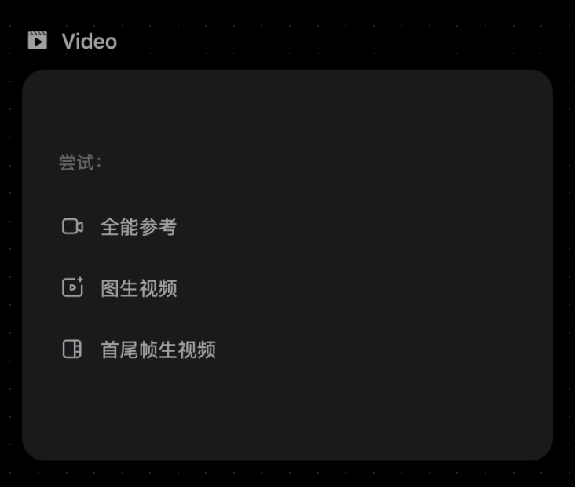
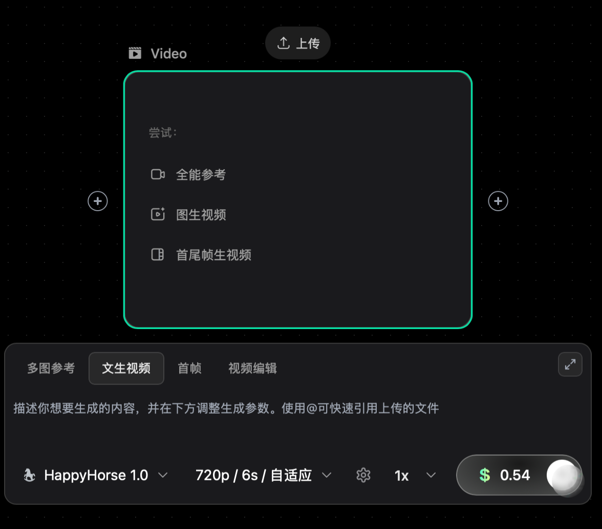

改造

1.video节点未选中时

2.video节点选中后显示，下方显示一个prompt框，使用现有的就好。prompt气泡框上方要有四个选项：首尾帧/文生视频/首帧/全能参考，

3.当点击 全能参考  时， 生成一个视频结点，节点左侧连接四个图片结点，一个视频结点，生成的视频结点气泡框中写着：
···
将@图片1的红衣女将军作为主体1、主体1的武器为@图片3主体3，@图片2的蓝衣女将军作为主体2，主体2的武器为@图片4主体4。
参考@视频1中两个女生打戏的灵动飘逸、刚柔并济风格，制作两位女将军对战的相同动作、相同质感视频。
故事线为：0-2秒，主体1挥动主体3，击打主体2，主体2被弹开、落入下风，具体参考@视频1。3-12秒，接着展示两人正式交锋的打戏画面具体参考@视频1，主体1使用主体3，主体2使用主体4，主体1（情绪：专注、桀骜）、主体2（情绪：不甘、奋进）。13-14秒，主体1再次击打开主体2，主体2落入下风，具体参考@视频1。
整体画面色调偏古风氛围感，光影细腻柔和，节奏张弛有度，搭配古风激昂又有韵律的背景音乐，镜头切换流畅，突出主体1与主体2的辨识度，让视频自然流畅、吸睛有质感。
···
